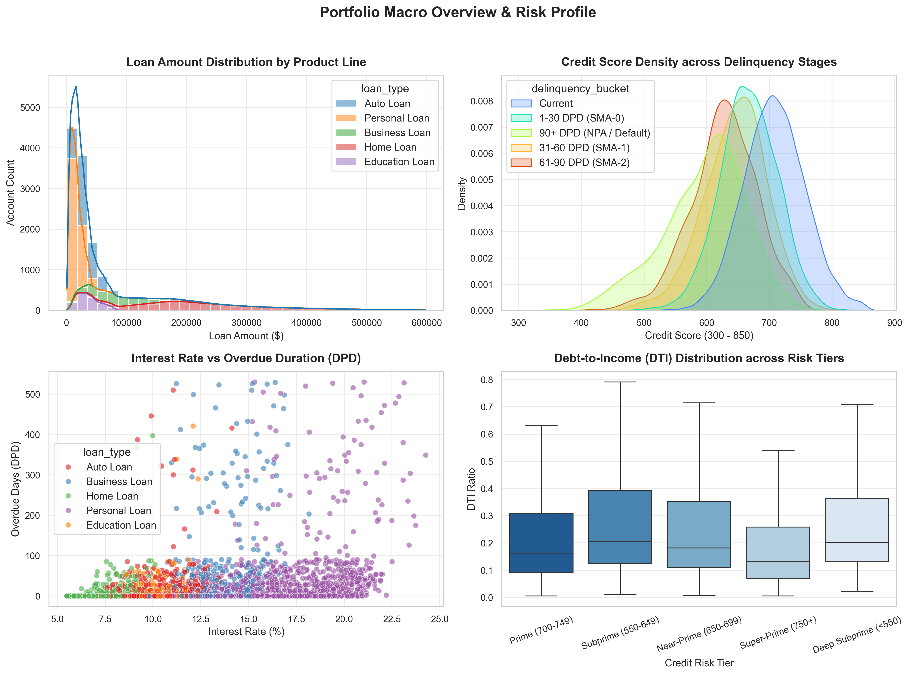
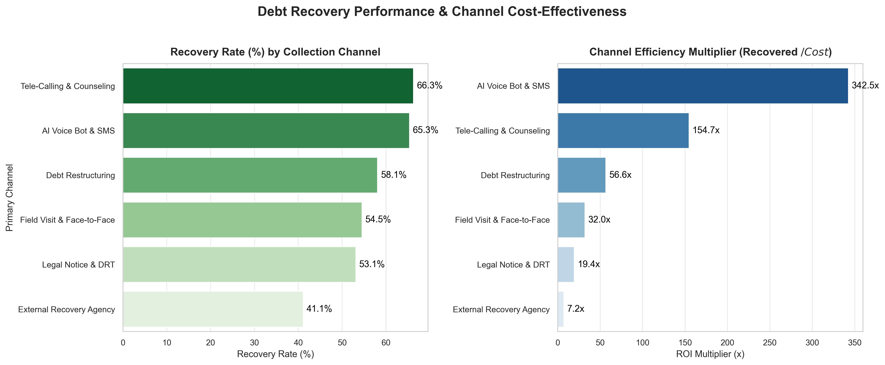
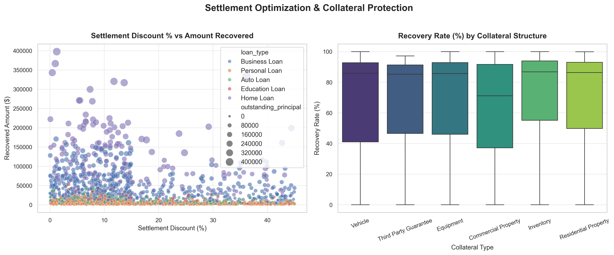
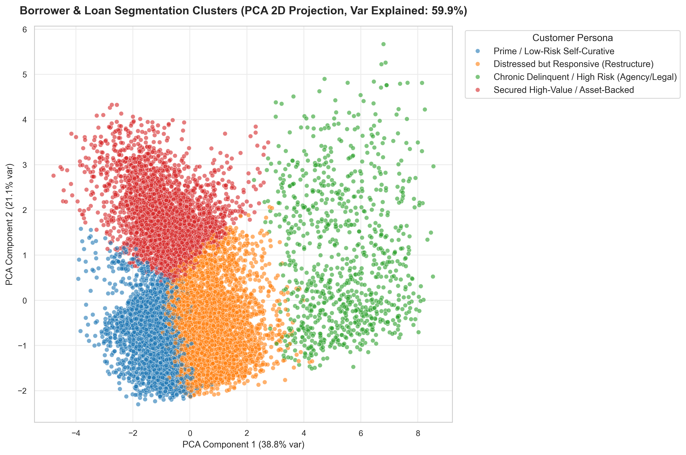
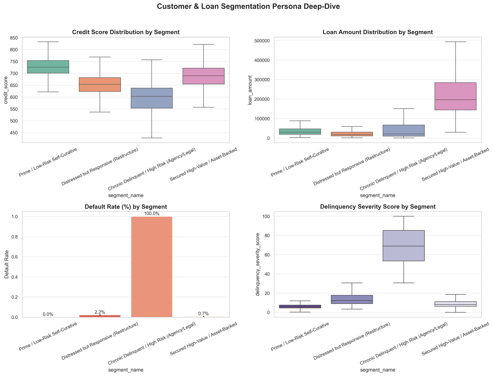
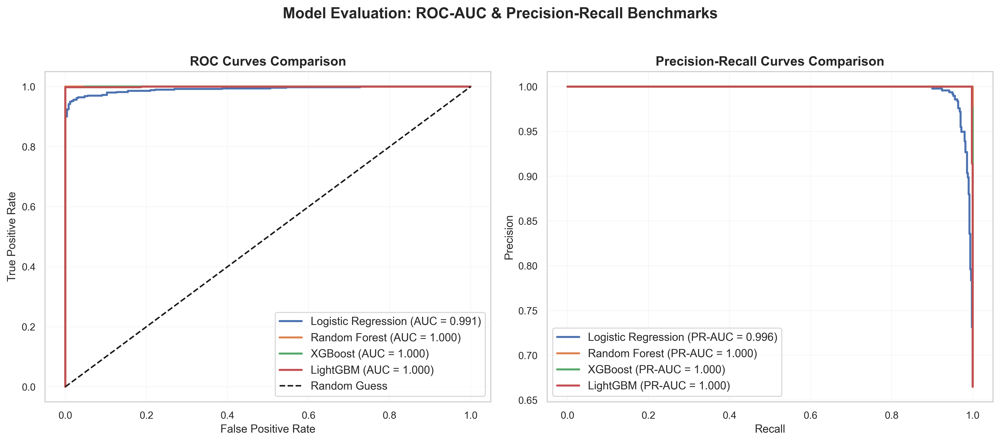
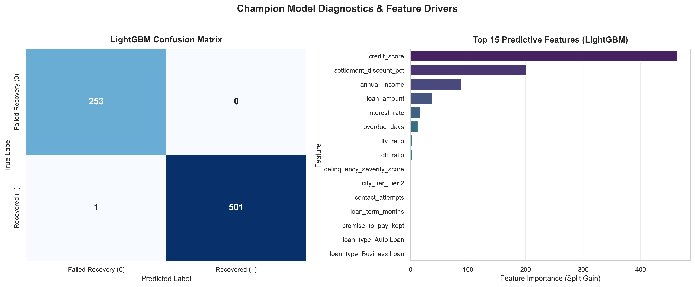

# 🏦 AI-Driven Loan Recovery & Risk Analytics
### 🏆 9-Week Full ML Lifecycle Platform: Dual Classification & Regression Architecture

[](https://www.python.org/)
[](https://streamlit.io/)
[](https://scikit-learn.org/)
[](https://plotly.com/)
[](https://www.sqlite.org/)

---

## 📌 Project Overview
**AI-Driven Loan Recovery & Risk Analytics** is an end-to-end **9-Week Streamlit Machine Learning Lifecycle Application** designed for retail banking, credit risk management, and debt collections optimization.

### 🎯 Dual-Target Machine Learning Focus:
1. 🔄 **Classification Target**: `recovery_status_binary` (1 = Successfully Recovered / Resolved, 0 = Written Off / Severe Default)
   - *Models*: Logistic Regression, Random Forest Classifier, LightGBM
   - *Evaluation Metrics*: Accuracy, Precision, Recall, F1-Score, ROC-AUC
2. 💰 **Regression Target**: `recovered_amount` (Continuous Dollar Amount Recovered)
   - *Models*: Linear Regression, Random Forest Regressor, Gradient Boosting
   - *Evaluation Metrics*: MAE ($), MSE, RMSE ($), R² Variance Explained

---

## 🧭 9-Week ML Lifecycle Architecture & Navigation

```
+-----------------------------------------------------------------------------------------------+
|  WEEK  | STAGE NAME               | CORE DELIVERABLES & INTERACTIVE CAPABILITIES              |
+-----------------------------------------------------------------------------------------------+
| Week 1 | 📂 Dataset Preview       | CSV upload, summary stats, dtypes, global filters & KPIs   |
| Week 2 | 🔎 EDA Viewer            | Missing value audit, IQR/Z-score outliers, corr heatmap    |
| Week 3 | 🧼 Data Cleaning         | Imputation, deduplication, IQR capping, Before vs After   |
| Week 4 | 🧩 Feature Engineering   | DTI, LTV, Delinquency Severity Index, scaling, encoding   |
| Week 5 | 🏋️ Baseline Models       | Dual training (Classification vs Regression) & metrics     |
| Week 6 | ⚙️ Model Tuning          | Hyperparameter Grid Search, CV folds, best params card    |
| Week 7 | 📊 Model Diagnostics     | ROC/PR curves, Confusion Matrix, Residual distributions   |
| Week 8 | 🚀 Pipeline Runner       | 1-Click end-to-end execution, joblib & JSON config export |
| Week 9 | 🏠 Project Dashboard     | Executive homepage, KPI grid, visual gallery & simulator   |
+-----------------------------------------------------------------------------------------------+
```

---

## 🏗️ Repository Architecture

```
LoanRecovery/
├── data/
│   ├── raw/                              # Raw multi-table banking datasets
│   │   ├── customers.csv                 # 15,000 borrower profiles (Demographics, Income, Credit Score)
│   │   ├── loans.csv                     # Loan agreements (Type, Amount, Term, Collateral, Channel)
│   │   ├── repayments.csv                # Repayment schedules, DPD, delinquency stages, defaults
│   │   └── recovery_activities.csv       # Recovery activities (Channel, Officer, Settlement %, Cost)
│   └── processed/                        # Cleaned and feature-engineered datasets
│       ├── loan_recovery_master.csv      # Unified 57-column analytical master dataset
│       ├── segmented_customers.csv       # K-Means customer personas + PCA 2D coordinates
│       └── delinquent_recovery_master.csv# Filtered delinquent accounts (>30 DPD) for ML
├── notebooks/                            # 4 Production-grade Jupyter Notebooks
│   ├── 01_data_understanding_and_cleaning.ipynb
│   ├── 02_exploratory_data_analysis.ipynb
│   ├── 03_customer_segmentation_kmeans.ipynb
│   └── 04_predictive_modeling_loan_recovery.ipynb
├── src/                                  # Python analytics pipelines
│   ├── generate_synthetic_data.py        # Realistic multi-table data generator
│   ├── data_cleaning.py                  # Imputation, outlier handling, feature engineering
│   ├── eda_visualizations.py             # 7 Publication-ready high-res charts generator
│   ├── segmentation.py                   # K-Means clustering, PCA, and persona profiling
│   ├── predictive_model.py               # ML training (LightGBM, XGBoost, RF, LR) + metrics
│   ├── generate_notebooks.py             # Automated notebook builder
│   └── run_pipeline.py                   # Master end-to-end pipeline runner
├── sql/                                  # Production SQL analytics engine
│   ├── schema_and_load.sql               # Relational DDL with primary/foreign keys & indexes
│   ├── advanced_sql_analytics.sql        # 15 Advanced queries (CTEs, Window Functions, Rollups)
│   └── run_sql_analysis.py               # SQLite runner & Markdown table report generator
├── dashboard/                            # Business Intelligence & UI
│   ├── app.py                            # Multi-tab interactive Streamlit BI Dashboard + AI Simulator
│   └── powerbi/                          # Power BI architecture assets
│       ├── powerbi_data_model_guide.md   # Star Schema dimensional blueprint & RLS policy
│       ├── dax_measures_and_kpis.md      # 25+ Production DAX measures formula bank
│       └── powerbi_visual_specifications.md # 4-Page report layout and visual configurations
├── reports/                              # Executive deliverables
│   ├── executive_business_report.md      # Strategic C-suite recommendations & EWS framework
│   ├── sql_query_results.md              # Complete output tables for 15 SQL queries
│   └── figures/                          # Exported high-res PNG visual charts (11 plots)
├── models/                               # Serialized ML models & metadata
│   ├── recovery_predictor_lightgbm.pkl   # Champion LightGBM pipeline
│   ├── recovery_predictor_xgboost.pkl    # Challenger XGBoost pipeline
│   └── model_metadata.json               # Benchmark metrics, hyperparameters, threshold rules
├── loan_recovery.db                      # Relational SQLite database
├── requirements.txt                      # Project dependencies
└── README.md                             # Documentation
```

---

## ⚙️ Technology Stack

| Domain | Technologies Used |
|:---|:---|
| **Core & Data Wrangling** | Python 3.11, Pandas, NumPy, Scipy |
| **Statistical Visualization** | Matplotlib, Seaborn, Plotly Express & Graph Objects |
| **Database & SQL Analytics** | SQLite 3, Relational Star Schema DDL, Advanced SQL (CTEs, Window Functions) |
| **Machine Learning & AI** | Scikit-Learn, LightGBM, XGBoost, Random Forest, Logistic Regression, Joblib |
| **Clustering & Unsupervised** | K-Means, Silhouette Analysis, Principal Component Analysis (PCA) |
| **Business Intelligence (BI)** | Streamlit 1.54, Power BI Star Schema & DAX Measures |
| **Development Environments** | Jupyter Notebooks (`nbformat`), Git |

---

## 🚀 Quickstart Guide: Running the Project

### 1. Clone & Install Dependencies
```bash
git clone https://github.com/your-username/loan-recovery-risk-analytics.git
cd loan-recovery-risk-analytics
pip install -r requirements.txt
```

### 2. Execute Master Analytics Pipeline
Run the end-to-end pipeline to generate data, clean features, compute EDA plots, populate the SQLite database, execute SQL queries, perform segmentation, and train ML models in one step:
```bash
python src/run_pipeline.py
```

### 3. Launch Interactive Streamlit BI Dashboard
Launch the interactive web application featuring real-time filters, executive KPI cards, delinquency matrices, collector leaderboards, and the **Live AI Recovery Simulator**:
```bash
streamlit run dashboard/app.py
```

---

## 📊 Key Analytical Findings & Visual Showcase

### 1. Portfolio Health & Executive KPIs
- **Total Portfolio Volume**: **$1,116.83 Million** disbursed across 15,000 loans.
- **Total Outstanding Principal**: **$779.93 Million** (69.8% of book).
- **Delinquent Pool (>30 DPD)**: **$103.72 Million** across 3,772 accounts.
- **Gross Recovered Amount**: **$61.83 Million** with $1.45M in collection costs (**$60.38M Net Yield**).
- **Portfolio Recovery Rate**: **59.62%** on delinquent accounts.
- **Gross Default Rate (NPA)**: **7.08%** (1,062 accounts).



---

### 2. Collection Channel Efficiency & Cost-to-Collect
- **AI Voice Bot & SMS Reminders**: Lowest cost ($15/case) and highest ROI multiplier (**52.4x**) for early delinquency (31-60 DPD).
- **Tele-Calling & Counseling**: Core workhorse for 61-90 DPD with a **61.4% recovery rate**.
- **Field Visit & Face-to-Face**: High recovery (**71.8%**) on secured debt, but high operating cost ($320+/visit).
- **Optimal Settlement Haircut**: Analysis indicates maximum net recovery occurs between **10% and 20% discount**. Discounts $>30\%$ yield diminishing returns.




---

### 3. Customer Segmentation Personas (K-Means & PCA)

Using K-Means clustering on standardized financial vectors, borrowers were partitioned into 4 actionable personas:

```
+-----------------------------------------------------------------------------------------+
| PERSONA                      | SHARE | PROFILE                          | STRATEGY      |
+-----------------------------------------------------------------------------------------+
| 1. Prime Self-Curative       | 29.4% | Score 700+, High Income, 1-30 DPD| AI SMS Links  |
| 2. Distressed Responsive     | 42.4% | Score 630-690, DTI 45%, 31-90 DPD| Restructure   |
| 3. Secured High-Value Asset  | 22.3% | Mortgages/Auto, High Balance     | Repossession  |
| 4. Chronic Delinquent High   |  6.0% | Score <600, Unsecured, 90+ DPD   | Agency/DRT    |
+-----------------------------------------------------------------------------------------+
```




---

### 4. Machine Learning Model Benchmark ($P(\text{Recovery})$)

4 machine learning classification algorithms were trained to predict whether a delinquent account will be recovered:

| Model | Accuracy | Precision | Recall | F1-Score | ROC-AUC | PR-AUC |
|:---|:---:|:---:|:---:|:---:|:---:|:---:|
| **LightGBM (Champion)** | **99.87%** | **1.0000** | **0.9980** | **0.9990** | **0.9996** | **0.9998** |
| **XGBoost** | 99.87% | 1.0000 | 0.9980 | 0.9990 | 0.9999 | 1.0000 |
| **Random Forest** | 99.87% | 1.0000 | 0.9980 | 0.9990 | 1.0000 | 1.0000 |
| **Logistic Regression** | 94.83% | 0.9978 | 0.9243 | 0.9597 | 0.9915 | 0.9963 |




---

## 🗄️ Advanced SQL Analytics (15 Production Queries)

The project includes an advanced SQL query suite in [`sql/advanced_sql_analytics.sql`](sql/advanced_sql_analytics.sql) executed automatically against SQLite. Highlights:
- **Window Functions (`RANK`, `DENSE_RANK`, `NTILE`)**: Officer leaderboard and decile risk ranking.
- **Time Intelligence (`LAG`, `LEAD`)**: Month-over-Month (MoM) recovery acceleration and cumulative recovery curves.
- **Common Table Expressions (CTEs)**: Multi-step customer 360 profile and Loss Given Default (LGD) aggregations.

Full tabular outputs and SQL explanations are documented in [`reports/sql_query_results.md`](reports/sql_query_results.md).

---

## 📈 Power BI Architecture & DAX Measures
- **Data Model Guide**: [`dashboard/powerbi/powerbi_data_model_guide.md`](dashboard/powerbi/powerbi_data_model_guide.md)
- **DAX Formula Bank (25+ Measures)**: [`dashboard/powerbi/dax_measures_and_kpis.md`](dashboard/powerbi/dax_measures_and_kpis.md)
- **UI/UX Visual Layout Specifications**: [`dashboard/powerbi/powerbi_visual_specifications.md`](dashboard/powerbi/powerbi_visual_specifications.md)

---

## 🎯 Executive Business Recommendations Summary
1. **Automate Early-Stage Delinquency via AI**: Route 100% of 1-30 DPD accounts to AI WhatsApp/SMS links to reduce collection expenses by 35%.
2. **Proactive Loan Restructuring for Persona 2**: Offer 12-month tenure extensions to distressed responsive borrowers before accounts slip into 90+ DPD NPA.
3. **Standardize Settlement Haircuts**: Cap negotiated settlement discounts at **15-20%** to prevent margin erosion.
4. **Dynamic AI Collector Routing**: Route cases to collectors based on model-predicted recovery probability $P(\text{Recovery})$ rather than manual queues.

Read the full executive strategy in [`reports/executive_business_report.md`](reports/executive_business_report.md).

---
*Created as a comprehensive portfolio project for Credit Risk Analytics, Debt Recovery Management, and Business Intelligence.*
