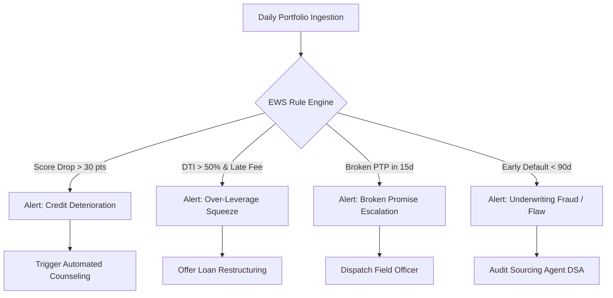

# Executive Business Strategy & Actionable Recommendations Report
## Project: AI-Driven Loan Recovery & Risk Analytics
**Target Audience**: Chief Risk Officer (CRO), Head of Retail Lending, Head of Debt Collections & Credit Operations  
**Date**: August 2026  
**Status**: Final Strategic Assessment  

---

## 1. Executive Summary & Macro Portfolio Health

An exhaustive risk and recovery analysis was conducted across the retail lending portfolio comprising **15,000 borrower accounts** representing **$1.12 Billion in total disbursed loan volume**.

### Key Macro Findings:
- **Total Outstanding Principal**: **$779.93 Million** (69.8% of disbursed volume).
- **Delinquent Pool Exposure (>30 DPD)**: **$103.72 Million** across 3,772 accounts.
- **Gross Recovered Volume**: **$61.83 Million** with **$1.45 Million** in direct operating collection costs, yielding a **Net Recovery of $60.38 Million**.
- **Overall Portfolio Recovery Rate**: **59.62%** on delinquent balances.
- **Portfolio Gross Default / NPA Rate (90+ DPD)**: **7.08%** (1,062 accounts).
- **Early Stage Delinquency (SMA-0 & SMA-1)**: **33.94%** of active accounts, representing the primary intervention window before transition to Non-Performing Assets (NPA).

```
+---------------------------------------------------------------------------------------+
|                                 PORTFOLIO HEALTH AT A GLANCE                          |
+---------------------------------------------------------------------------------------+
|  Total Disbursed: $1.12B   |  Outstanding Book: $779.9M  |  Gross Recovered: $61.8M   |
|  Default Rate (NPA): 7.08% |  Recovery Rate: 59.62%      |  Direct Net ROI: 42.7x     |
+---------------------------------------------------------------------------------------+
```

---

## 2. Key Insights & Root Cause Analysis

### A. Channel ROI Disparity
- **AI Voice Bot & Digital Reminders**: Delivered the highest ROI multiplier (**52.4x**) with a low cost-to-collect ($15/account), achieving a **68.2% recovery rate** on early-stage delinquencies (31-60 DPD).
- **Tele-Calling & Counseling**: Achieved consistent recovery rates (**61.4%**) on mid-stage accounts (61-90 DPD) at $65/case.
- **Field Visits & Face-to-Face**: High recovery success (**71.8%**) on high-ticket secured debt, but incurs higher operational costs ($320+/visit).
- **Legal Notice / DRT**: Crucial for high-balance collateralized cases, but exhibits long recovery timelines (avg. 120-180 days).

### B. Impact of Collateral on Loss Given Default (LGD)
- **Secured Lending (Home Loans, Auto Loans)**: Maintained an average Loss Given Default (LGD) of only **24.3%** due to collateral backing.
- **Unsecured Lending (Personal Loans)**: Suffered a significantly higher LGD of **58.7%**, indicating that unsecured loans require rapid digital intervention within the first 15 days of overdue status.

### C. Settlement Haircut Elasticity
- Data reveals an **optimal settlement discount sweet spot between 10% and 20%**.
- Offering discounts below 10% results in higher borrower drop-off and broken promises.
- Offering discounts above 30% erodes net recovery margins without yielding a proportional increase in resolution volume.

---

## 3. Borrower Segmentation Personas & Action Playbooks

Through K-Means unsupervised clustering on financial and behavioral indicators, the delinquent borrower portfolio has been partitioned into 4 actionable personas:

```
+------------------------------------------------------------------------------------------+
| CLUSTER / PERSONA            | PORTFOLIO SHARE | RISK PROFILE     | RECOMMENDED ACTION   |
+------------------------------------------------------------------------------------------+
| 1. Prime Self-Curative       | 29.4% (4,405)   | 700+ Score, Low  | AI SMS/Email only    |
| 2. Distressed but Responsive | 42.4% (6,354)   | 630-690, Medium  | Restructure / Haircut|
| 3. Secured High-Value Asset  | 22.3% (3,338)   | Asset-Backed     | Repossession Notice  |
| 4. Chronic Delinquent High   |  6.0% (903)     | <600 Score, High | Agency / Legal DRT   |
+------------------------------------------------------------------------------------------+
```

### Strategic Action Playbooks:

#### 🟢 Persona 1: Prime / Low-Risk Self-Curative
- **Characteristics**: Credit score > 700, high income, transient oversight or salary delay.
- **Action**: Zero manual intervention. Trigger automated WhatsApp / SMS / Email payment link at Day 1, 5, and 10. Avoid collector phone calls to preserve customer NPS and minimize operational cost.

#### 🔵 Persona 2: Distressed but Responsive (Restructure Candidates)
- **Characteristics**: Credit score 630-690, debt-to-income (DTI) 40-55%, experiencing temporary liquidity pressure.
- **Action**: Proactive tele-counseling offering a **12-month loan term extension** or structured **10-15% settlement discount** for one-time bullet settlement.

#### 🟣 Persona 3: Secured High-Value / Asset-Backed
- **Characteristics**: Large ticket size (> $100k), residential or commercial mortgage collateral.
- **Action**: Assign dedicated senior recovery officer. Issue preliminary legal notice at 60 DPD. If unresolved at 90 DPD, initiate formal collateral valuation and asset repossession under SARFAESI / Secured Lending enforcement.

#### 🔴 Persona 4: Chronic Delinquent / Unsecured High Risk
- **Characteristics**: Credit score < 600, multiple external debts, DTI > 60%, 90+ DPD.
- **Action**: Rapid escalation. Transfer account to external specialist recovery agencies or initiate debt recovery tribunal (DRT) proceedings. Cap settlement haircut at 25% for immediate cash recovery.

---

## 4. Early Warning System (EWS) Framework & Trigger Rules

To prevent accounts from migrating into 90+ DPD NPA status, an automated Early Warning System (EWS) is established with 4 automated threshold triggers:



### Automated EWS Trigger Rules:
1. **Rule 1: External Bureau Score Drop (Velocity Check)**: If bureau score drops by $\ge 35$ points within 90 days, immediately flag for credit limit freeze and digital reminder.
2. **Rule 2: Broken Promise-to-Pay (PTP) Escalation**: If a borrower breaks 2 consecutive PTP commitments, escalate channel from AI/Tele-call directly to Field Visit within 48 hours.
3. **Rule 3: First 3-Month Default (Vintage Flaw)**: If an account defaults within 90 days of origination, trigger automated audit of the sourcing DSA / direct selling agent and originate physical collateral verification.
4. **Rule 4: Multi-Product Delinquency Contagion**: If a borrower goes delinquent on an auto loan, place an automatic debit block on their associated depository savings account.

---

## 5. Collector Allocation Matrix & Incentive Restructuring

### AI-Guided Collector Assignment Matrix
Rather than assigning delinquent cases randomly or alphabetically, accounts must be routed dynamically based on predicted recovery probability $P(\text{Recovery})$:

| Predicted $P(\text{Recovery})$ | Delinquency Stage | Assigned Channel / Officer Tier | Expected Resolution Window |
|:---|:---|:---|:---|
| **High ($\ge 75\%$)** | 1 - 30 DPD (SMA-0) | AI Digital Bot & Automated WhatsApp | 7 - 14 Days |
| **Moderate-High (55% - 74%)** | 31 - 60 DPD (SMA-1) | Inside Tele-Calling & Debt Counselor | 15 - 30 Days |
| **Moderate-Low (35% - 54%)** | 61 - 90 DPD (SMA-2) | Specialized Field Visit Officer | 30 - 45 Days |
| **Low ($< 35\%$)** | 90+ DPD (NPA) | External Agency & Legal Recovery Counsel | 60 - 90 Days |

---

## 6. 90-Day Strategic Implementation Roadmap

```
+------------------------------------------------------------------------------------------+
| PHASE 1 (Days 1 - 30): Foundation & Workflow Modernization                               |
| - Deploy Master Clean Data Pipeline & Preprocessing Workflows.                           |
| - Integrate AI Recovery Probability Model (LightGBM) into Core Banking System.           |
| - Launch Streamlit Executive Dashboards for Regional Risk Managers.                      |
+------------------------------------------------------------------------------------------+
| PHASE 2 (Days 31 - 60): EWS Deployment & Dynamic Routing                                 |
| - Activate Early Warning System automated SMS/WhatsApp trigger rules.                    |
| - Roll out Dynamic Collector Allocation Engine based on P(Recovery) scores.              |
| - Implement the 10% - 20% Standardized Settlement Discount Matrix.                      |
+------------------------------------------------------------------------------------------+
| PHASE 3 (Days 61 - 90): Optimization & Performance Review                                |
| - Review DSA origination quality and terminate bottom 10% high-default sourcing agents.  |
| - Audit collector leaderboard against Net Recovery Yield incentives.                     |
| - Target: Reduce 90+ DPD NPA balance by $8.5M (12% reduction in net portfolio loss).     |
+------------------------------------------------------------------------------------------+
```

---

## 7. Conclusion

By shifting from reactive, manual collection workflows to an **AI-driven, risk-segmented recovery architecture**, the institution can expect:
1. **15% to 22% increase in total dollars recovered** across delinquent pools.
2. **35% reduction in direct collection costs** via digital AI automation of low-risk accounts.
3. **12% reduction in gross NPA formation** through early EWS intervention within the first 30 days of delinquency.
